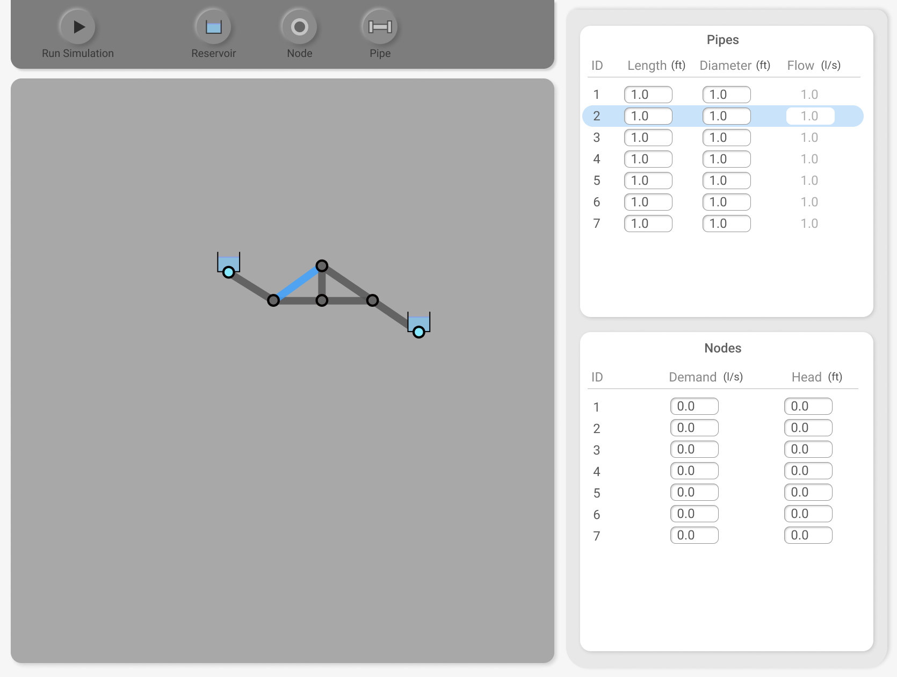

# Visualize Pipe Flow!

## Currently Under Development

## Working Demo: https://adam.teaches.engineering/skunkworks

### Usage:
- Shift + click on the grid to add nodes.
- Alt + click between nodes to add pipes.
- Click on a node or pipe to change properties. Click submit when you want the property to change.
- Designate at least two nodes as a source / reservoir and give them an elevation difference.
- Click the play button! The pipes are colored red as a percentage of maximum flow.

